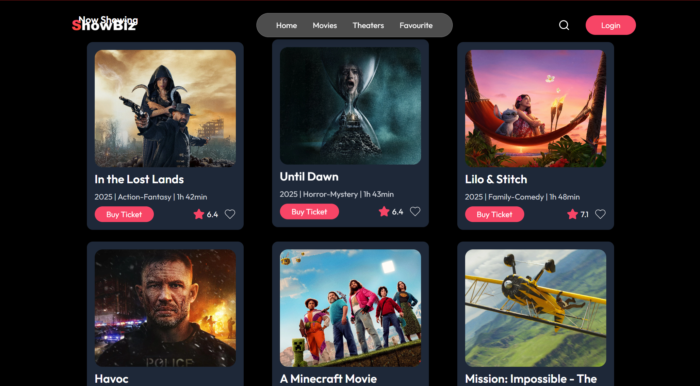
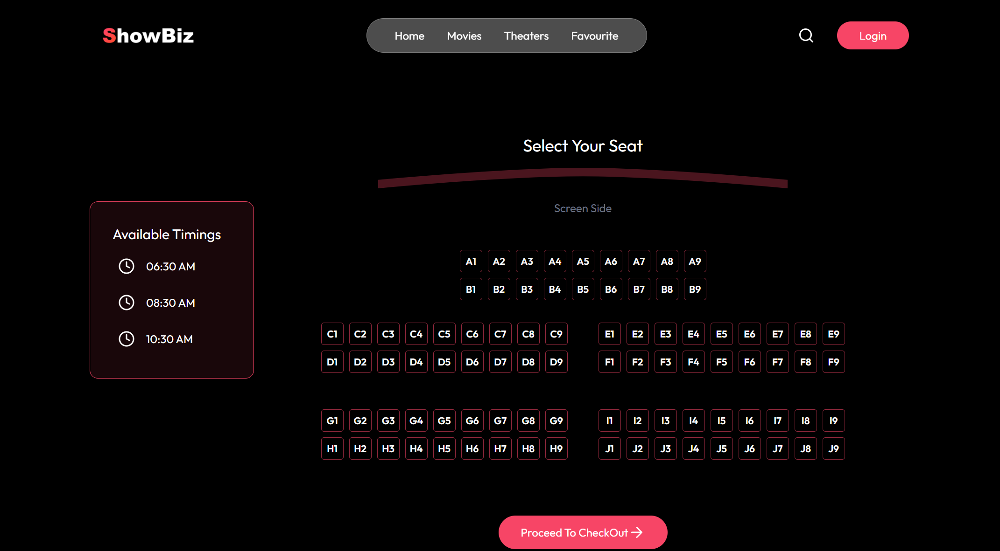
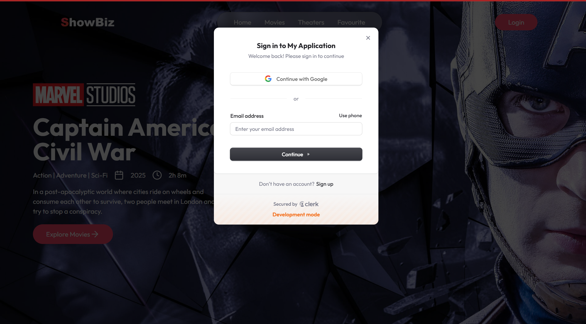

🎟️ TicketBooking – Movie Ticket Booking Web App - ShowBiz
------------------------------------------------------------------
A modern and responsive movie ticket booking platform built with React and Tailwind CSS, integrated with Clerk for authentication and Stripe for secure online payments. Users can browse movies, book seats, and view their bookings under their personalized My Bookings section. Styled for performance, built for real-world use.

💳 Book securely, 🔐 Login instantly, 🎫 Enjoy your movie.

🚀 Live Demo
-------------------------------------------------------------------------------------------------------------------------------------------------------------------------------------------------
🌍 Live on Vercel
📦 GitHub Repository

📸 Screenshots
---------------------------------------------------------------------------------------------------------------------------------------------------------------------------------------------------
#### 🏠 Homepage

#### 🎬 Movie Details

#### 🎟️ Seat Layout

#### 🔐 Login / Signup

⭐ Features
------------------------------------------------------------------------------------------------------------------------------------------------------------------------------------------------

🔐 User Authentication with Clerk

🎞️ Browse & Book Tickets for Movies

🪑 Interactive Seat Selection UI

💳 Stripe-Powered Secure Payments

📂 "My Bookings" Section with Past Reservations

🖼️ Fully Responsive Design for Mobile, Tablet, Desktop

⚡ Toast Notifications with React-Toastify

🎨 Fast, modern UI with Tailwind CSS

🚀 Auto Deploys with GitHub → Vercel

🧰 Tech Stack
--------------------------------------------------------------------------------------------------------------------------------------------------------------------------------------------------
Tech	Usage
React.js	Frontend Framework
Tailwind CSS	Styling Framework
Clerk	Authentication (Login/Signup)
Stripe	Online Payments Integration
React Toastify	Notifications
React Native Web APIs	Enhanced browser APIs usage
Vercel	Hosting & Continuous Deployment

🗂️ Folder Structure
-----------------------------------------------------------------------------------------------------------------------------------------------------------------------------------------------------
bash
Copy
Edit
ticketbooking/
├── public/
├── src/
│   ├── assets/           # App assets like images/icons
│   ├── components/       # Reusable UI components
│   ├── pages/            # Main route pages
│   ├── utils/            # Time formatting, helpers, etc.
│   └── App.jsx           # Root app component
├── .env                 # Environment variables
├── tailwind.config.js
└── README.md

👤 Author
----------------------------------------------------------------------------------------------------------------------------------------------------------------------------------------------------
Rahul Pal

GitHub: https://github.com/Raahul423

Portfolio: yourportfolio.com (optional)

📄 License
-------------------------------------------------------------------------------------------------------------------------------------------------------------------------------------------------
This project is licensed under the [MIT License](./LICENSE).

⚙️ Setup & Installation
--------------------------------------------------------------------------------------------------------------------------------------------------------------------------------------------------
bash
Copy
Edit
# 1. Clone the project
git clone https://github.com/Raahul423/ShowBiz.git
cd ShowBiz

# 2. Install dependencies
npm install

# 3. Run development server
npm run dev
